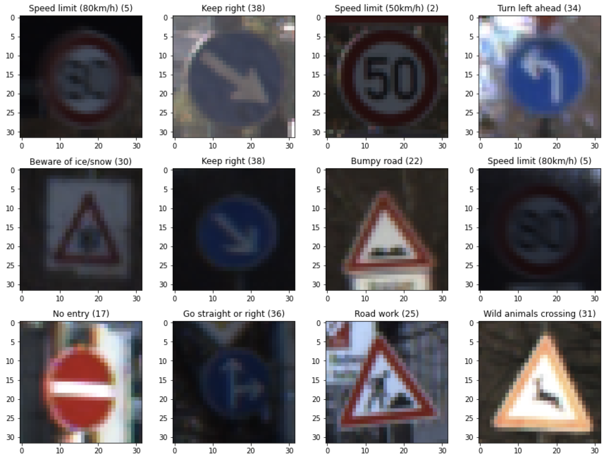
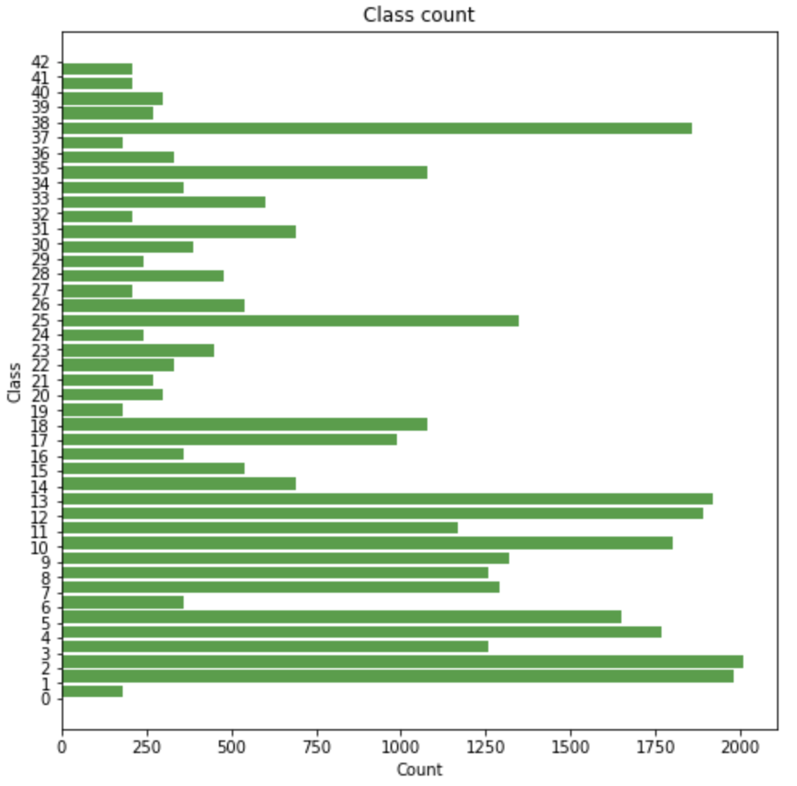
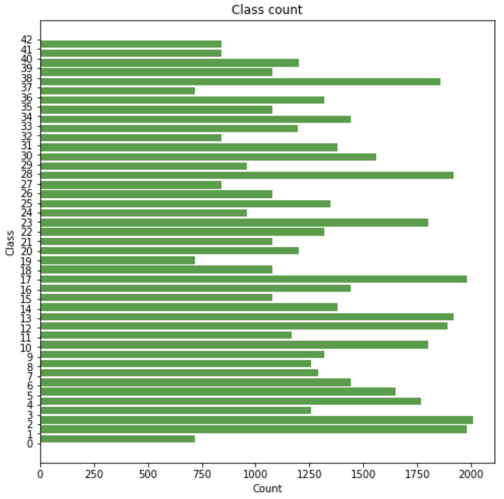
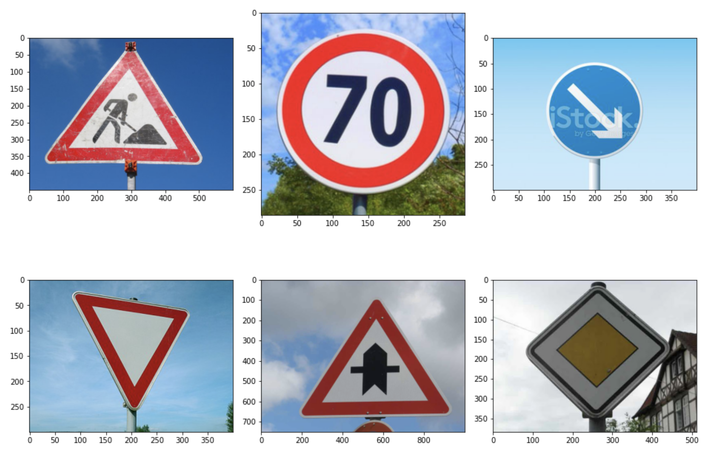
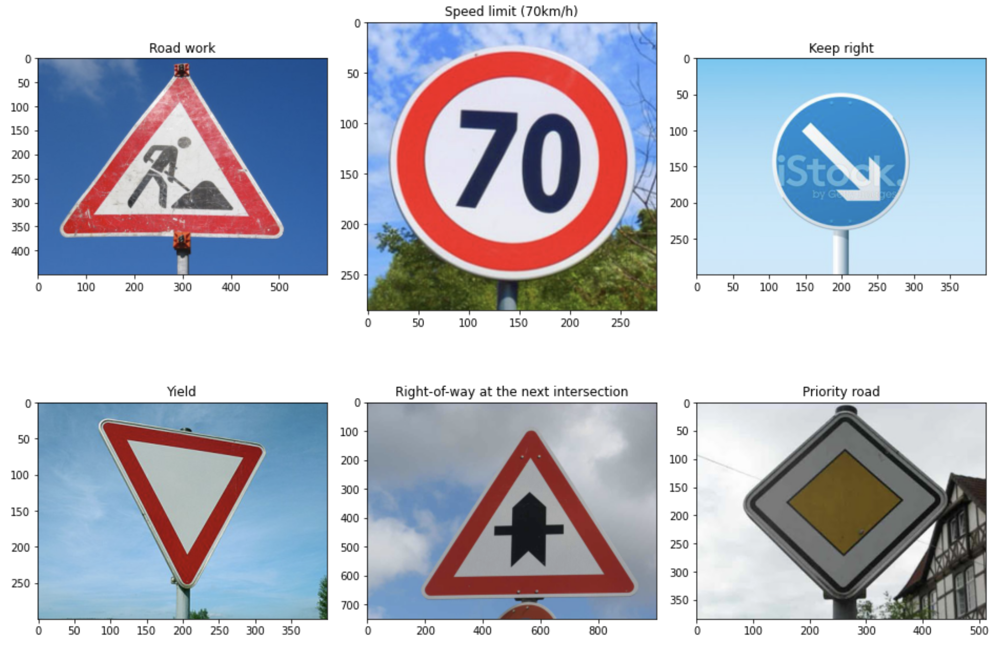

# **Traffic Sign Recognition**



The goals / steps of this project are the following:

- Load the data set (see below for links to the project data set)
- Explore, summarize and visualize the data set
- Design, train and test a model architecture
- Use the model to make predictions on new images
- Analyze the softmax probabilities of the new images
- Summarize the results with a written report

Here is a link to my [project code](https://github.com/pavelmarkov/Traffic-Sign-Classifier/blob/master/Traffic_Sign_Classifier.ipynb)

### Data Set Summary & Exploration

#### 1. Basic summary of the data set.

I used the pandas library to calculate summary statistics of the traffic
signs data set:

- The size of training set is 34799 <!-- - The size of the validation set is ? -->
- The size of test set is 12630
- The shape of a traffic sign image is (32, 32, 3)
- The number of unique classes/labels in the data set is 43

#### 2. Exploratory visualization of the dataset.

Here is an exploratory visualization of the data set. It is a bar chart showing how the data distributed across traffic sign labels. Where label is an integer number from 0 to 42.



### Design and Test a Model Architecture

#### 1. Generating additional data.

I decided to generate additional data because training data is not evenly distributed through each label.

To add more data to the data set, I just duplicated images which is underrepresented in data. So, the new image distribution became look like this:



#### 2. Data preprocessing.

As a first step, I decided to convert the images to grayscale because colour doesn't play a role in asigning a label to the traffic sign.
The second step is normalizing each image, so that the data has mean zero and equal variance: (pixel - 128)/ 128.

#### 3. Final model architecture.

My final model consisted of the following layers:

|              Layer              |             Description             |
| :-----------------------------: | :---------------------------------: |
|              Input              |    32x32x1 normalized gray image    |
| Layer 1: Convolutional 5x5x1x6  |   inputs 32x32x1, outputs 28x28x6   |
|              RELU               |           RELU Activation           |
|             Pooling             |  Input = 28x28x6. Output = 14x14x6  |
| Layer 2: Convolutional 5x5x6x16 | Input = 14x14x6. Output = 10x10x16. |
|              RELU               |           RELU Activation           |
|             Pooling             |  Input = 10x10x16. Output = 5x5x16  |
|             Flatten             |    Input = 5x5x16. Output = 400.    |
|    Layer 3: Fully Connected     |     Input = 400. Output = 120.      |
|              RELU               |           RELU Activation           |
|    Layer 4: Fully Connected     |      Input = 120. Output = 84       |
|              RELU               |           RELU Activation           |
|    Layer 5: Fully Connected     |       Input = 84. Output = 10       |

#### 3. Training neural network.

To train the model, I used following hyperparameters:

|  Hyperparameter   | Value |
| :---------------: | :---: |
| type of optimizer |   1   |
|    batch size     |   1   |
| number of epochs  |   1   |
|   learning rate   |   1   |

#### 4. Finding a solution and getting the validation set accuracy to be at least 0.93.

After tuning hyperparameters (batch size, number of epochs, earning rate) and preprocessing the data I've got the following final model results:

<!-- - training set accuracy of ? -->

- validation set accuracy of ?
- test set accuracy of ?

### Test a Model on New Images

#### 1. Test the model on six German traffic signs found on the web.

Here are six German traffic signs that I found on the web:



The second image (70 km/h) might be difficult to classify because it's might be difficult for the model to distinguish it from "speed limit 20 km/h" and "30 km/h" traffic sign images.

#### 2. Discuss the model's predictions on these new traffic signs.

Here are the results of the prediction:



The model was able to correctly guess 6 of the 6 traffic signs, which gives an accuracy of 100%. Whereas on the test set the accuracy is about 90%, which is slightly worse.

#### 3. Softmax probabilities for each prediction. The top 5 softmax probabilities for each image.

The code for making predictions on my final model is located in the 11th cell of the Ipython notebook.

For the first image, the model is a little unsure that this is a Road work (probability of 0.998), leaving some space for Wild animals crossing sing. For the other 5 images the model is 100% sure. The top five soft max probabilities were:

| Probability |              Prediction               |
| :---------: | :-----------------------------------: |
|    0.998    |               Road work               |
|    1.000    |         Speed limit (70km/h)          |
|    1.000    |              Keep right               |
|    1.000    |                 Yield                 |
|    1.000    | Right-of-way at the next intersection |
|    1.000    |             Priority road             |

```
Top 5 Softmax Probabilities For Each Image:
array([[0.998, 0.002, 0.000, 0.000, 0.000],
       [1.000, 0.000, 0.000, 0.000, 0.000],
       [1.000, 0.000, 0.000, 0.000, 0.000],
       [1.000, 0.000, 0.000, 0.000, 0.000],
       [1.000, 0.000, 0.000, 0.000, 0.000],
       [1.000, 0.000, 0.000, 0.000, 0.000]], dtype=float32)
```

```
Top 5 labels for each image:
[   [   'Road work',
        'Wild animals crossing',
        'Bicycles crossing',
        'Bumpy road',
        'General caution'],
    [   'Speed limit (70km/h)',
        'Speed limit (20km/h)',
        'Speed limit (30km/h)',
        'Go straight or left',
        'General caution'],
    [   'Keep right',
        'Roundabout mandatory',
        'Priority road',
        'Speed limit (30km/h)',
        'Turn left ahead'],
    [   'Yield',
        'Priority road',
        'Speed limit (50km/h)',
        'Speed limit (100km/h)',
        'Keep right'],
    [   'Right-of-way at the next intersection',
        'Dangerous curve to the left',
        'Double curve',
        'Pedestrians',
        'Beware of ice/snow'],
    [   'Priority road',
        'End of no passing by vehicles over 3.5 metric tons',
        'Roundabout mandatory',
        'Speed limit (100km/h)',
        'Keep right']]
```
